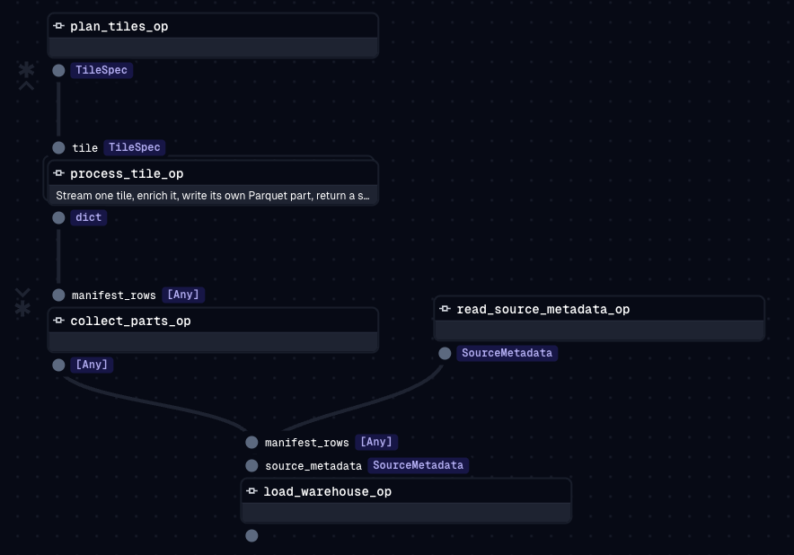

# COPC Point Cloud Pipeline

Streams a ~2 GB remote COPC (Cloud Optimized Point Cloud) LiDAR file over
HTTP, enriches it with ground elevation and height-above-ground, and loads
the result into a queryable DuckDB warehouse, orchestrated end to end as a
Dagster job with real retries and per-tile parallelism.

Source file: SoFi Stadium LiDAR scan, 364,384,576 points, hosted on S3.

## Architecture




Real screenshot from the Dagster UI, `copc_pipeline_job`'s graph view.

- `read_source_metadata_op` reads the file's header, `plan_tiles_op` reads
  the octree hierarchy to build the tile grid. Neither one fetches point
  data.
- `plan_tiles_op` fans out to one `process_tile_op` per tile, the number of
  tiles is only known once the octree has been read, so this is a dynamic
  fan-out, not a fixed number of steps. Each `process_tile_op` streams just
  that one tile's points, enriches them, and writes them straight to its
  own Parquet file. Only a small summary dict comes back out, never the
  points themselves, that is what keeps memory bounded no matter how many
  tiles run at once.
- `collect_parts_op` waits for every tile to finish, then `load_warehouse_op`
  bulk loads all the Parquet files into DuckDB in one statement.

## Prerequisites

- [`uv`](https://docs.astral.sh/uv/getting-started/installation/)
- Python is pinned to 3.12 by `.python-version`, `uv` installs it automatically

## Setup

```bash
git clone https://github.com/nader-hachana/copc-pointcloud-pipeline.git copc-pipeline
cd copc-pipeline
uv sync
```

## Running the pipeline

**Fast smoke test**, a handful of tiles, local file, a few seconds:

```bash
rm -rf data/parts warehouse
COPC_SOURCE_URI=<path-to-a-local-.copc.laz-file> \
COPC_TILE_LIMIT=5 \
uv run python -c "
from copc_pipeline.definitions import defs
job = defs().get_job_def('copc_pipeline_job')
print('SUCCESS:', job.execute_in_process().success)
"
```

**Full run**, the real source file, all 256 tiles, takes about 15 to 20
minutes:

```bash
rm -rf data/parts warehouse
uv run python -c "
from copc_pipeline.definitions import defs
job = defs().get_job_def('copc_pipeline_job')
print('SUCCESS:', job.execute_in_process().success)
"
```

`COPC_SOURCE_URI` defaults to the live S3 URL if not set. Any `PipelineConfig`
field can be overridden the same way, prefixed `COPC_`, for example
`COPC_TILE_GRID_N=8` or `COPC_MAX_CONCURRENT=8`.

**Through the Dagster UI**, to see the actual DAG graph, the tile fan-out,
and live run metadata:

```bash
uv run dg dev
```

Open `http://localhost:3000` → Jobs → `copc_pipeline_job` → Launchpad →
Launch Run. Set `COPC_TILE_LIMIT` before starting `dg dev` (not in the
Launchpad) if you want a smaller run, since config is read from real
environment variables, not Dagster's own config system.

## Verifying the output

**Data quality checks**, 4 real checks against the loaded warehouse (has
data, no null/empty voxels, height above ground never negative, and a
reconciliation check that each tile's warehouse total matches its own
manifest):

```bash
uv run python -m copc_pipeline.verify
```

**Query the warehouse directly**:

```bash
duckdb warehouse/copc_pipeline.duckdb
```
```sql
LOAD spatial;
SELECT COUNT(*) FROM voxel_features;
SELECT * FROM tile_manifest;
SELECT * FROM cell_profile LIMIT 10;
```

**Unit tests**, pure functions only, no network or file access needed:

```bash
uv run pytest -v
```

## Project structure

```
src/copc_pipeline/
  config.py       # PipelineConfig, every tunable parameter, COPC_ env vars
  source.py       # opens the COPC reader, reads header + octree metadata
  tiling.py       # splits the site into a grid, estimates points per tile
  enrich.py       # ground surface, height above ground, voxel aggregation
  storage.py      # writes Parquet parts, bulk loads into DuckDB
  verify.py       # data quality checks against the loaded warehouse
  verify_streaming.py  # manual proof that memory stays bounded while streaming
  metrics.py      # peak RSS helper
  defs/pipeline.py     # the real Dagster job wiring all of the above together
tests/            # unit tests for the pure functions (tiling geometry, enrichment math)
```

## Approach

I work in data engineering but had no prior experience with LiDAR or point
cloud formats before this challenge, COPC's octree structure, HTTP range
requests for remote streaming, and spatial enrichment were all new territory.
I used Claude Code throughout, both to accelerate implementation and to
research the unfamiliar parts of this domain (COPC's format, laspy's API,
Dagster's dynamic fan-out), but every non-trivial technical claim was
verified against the real file or the real installed library source before
it went into the code, not taken on trust. A few examples worth being
explicit about:

- **The tile planner started more complex than it needed to be.** The first
  version could adaptively split an overly dense tile into 4 smaller ones.
  After measuring that this never actually triggers on the real file, the
  densest tile comfortably fits under a reasonable per-tile budget without
  splitting, I simplified it back down. Both the original version and the
  simplification are separate, real commits, rather than squashed into one,
  so the actual evolution of the decision stays visible.
- **The streaming verification step caught its own first result being
  misleading.** Testing the first 5 tiles in grid order showed peak memory
  climbing every tile, which looks exactly like a leak. It wasn't, those 5
  tiles happen to sit on a real density gradient at the grid's edge. Testing
  the actual largest tiles instead showed the correct signature of bounded
  memory: a rise, then a flat plateau, even under several million points per
  tile.
- **A real bug was found by testing against real data, not by reading the
  code.** An early noise filter flagged statistical outliers per ground
  cell. Run against the real file, it silently discarded genuine data: one
  cell sits directly under the stadium roof, so it legitimately has points
  at both ground level and roof level, about 40 meters apart, in the same 2
  meter cell. A spread-based filter cannot tell a real second surface from
  noise. Removed in favor of relying only on the file's own `withheld` flag
  plus a percentile-based (not minimum-based) ground estimate.
- **Manual verification, not just unit tests, for anything touching real
  I/O.** Pure functions (tiling geometry, ground/height/voxel math) have
  pytest coverage. Anything touching the real COPC file, DuckDB, or the
  Dagster job itself was verified by actually running it: a deliberately
  broken source URL to confirm retries genuinely engage (3 attempts, then a
  clean failure), a real run launched through the Dagster UI, and the data
  quality checks run against both a small and the full 256-tile warehouse.

Full build history, including every real pivot, dead end, and verification
step with real numbers, is kept outside this repo in a build log, available
on request.
